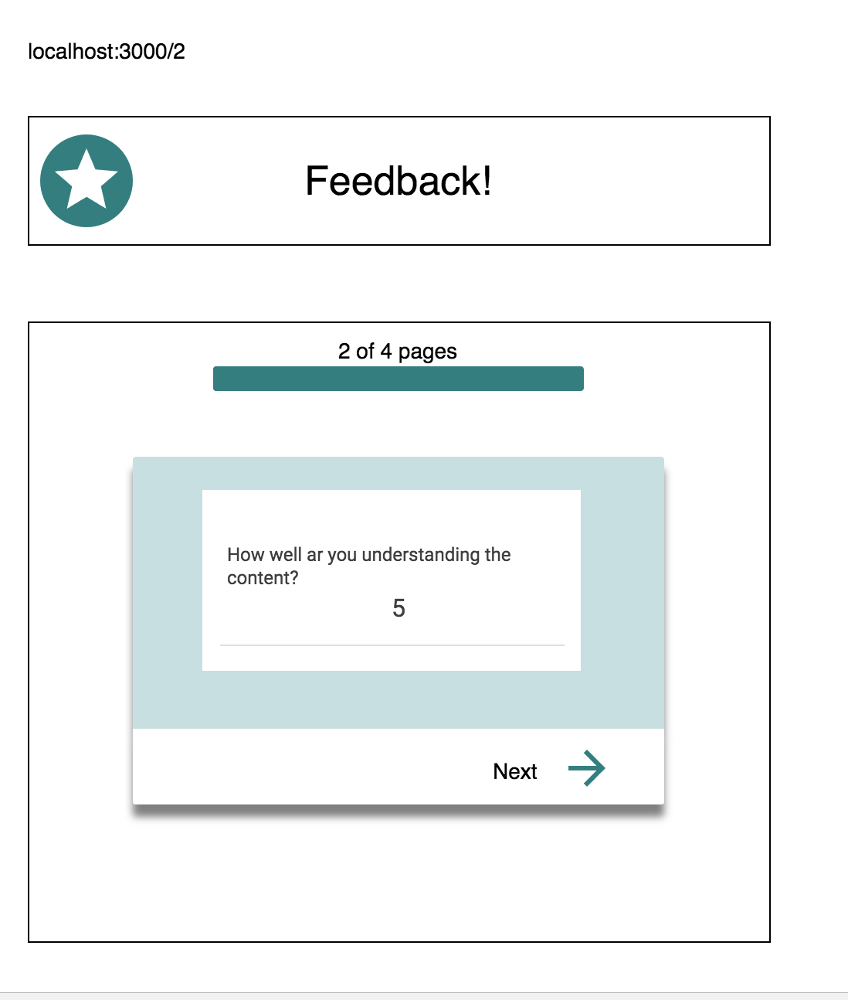

# Redux Feedback Loop

An appliction for recieving feedback on how the user is feeling about course material that they have taken.

### SETUP

Create your database and tables using the provided `data.sql` file. Start the server in terminal.

```
npm install
npm run server
```

Now that the server is running, open a new terminal tab with `cmd + t` and start the react client app.

```
npm run client
```

### Screenshots
- How are you feeling?

- How well are you understanding the content?

- How well are you being supported?

- Any comments you want to leave?

- Submission page

- Admin page


## STRETCH GOALS

- Deploy your project to Heroku -- you'll need to read the special instructions for building and deploying with these apps! 
